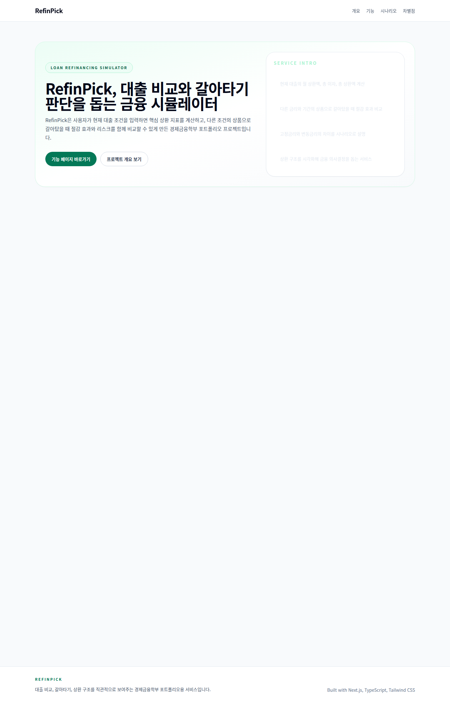
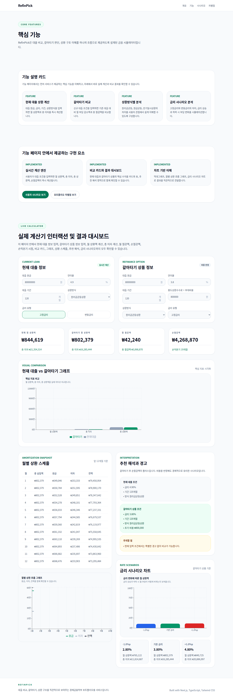
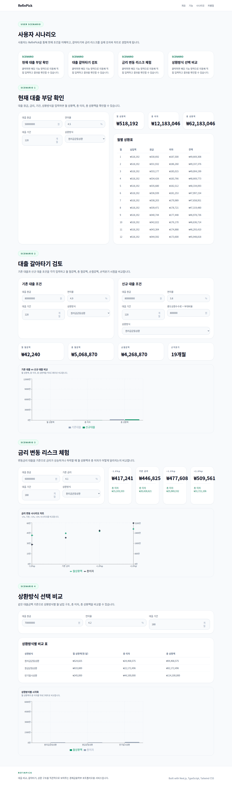
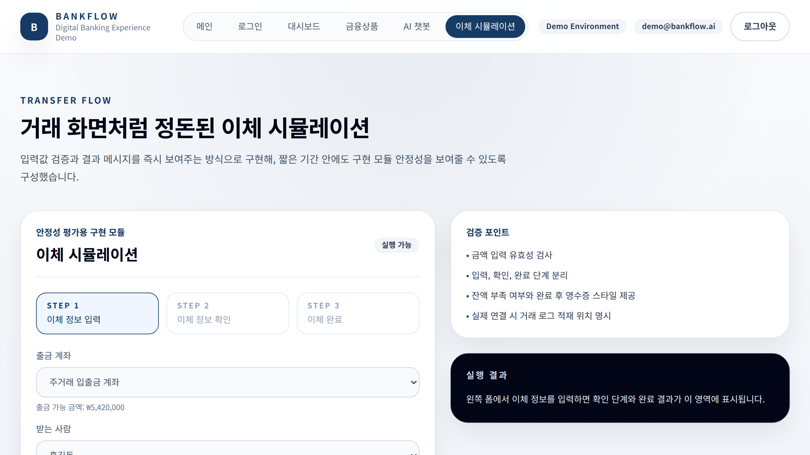
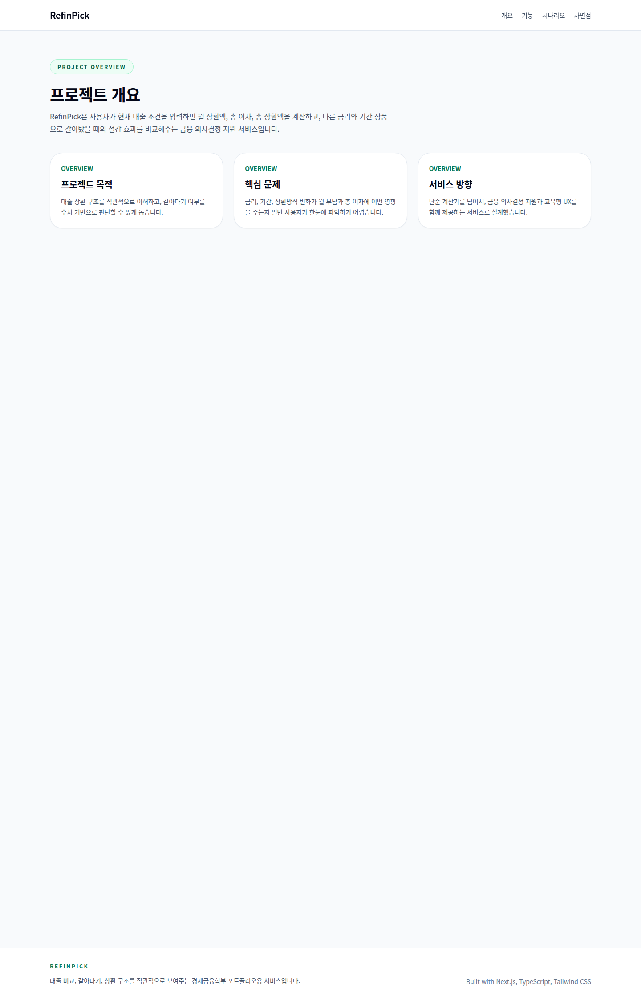

# RefinPick

경제금융학부 포트폴리오를 위한 **대출 비교, 갈아타기, 상환 시뮬레이터** 프로젝트입니다.

## 한줄 소개

RefinPick은 사용자가 현재 대출 조건을 입력하면 월 상환액, 총 이자, 총 상환액을 계산하고,
갈아타기 상품과의 절감 효과, 금리 변동 리스크, 상환방식 차이를 함께 비교할 수 있도록 만든 금융 의사결정 지원 서비스입니다.

## 프로젝트 배경

대출은 금리, 기간, 상환방식에 따라 실제 부담이 크게 달라지지만,
일반 사용자가 그 차이를 직관적으로 이해하기는 쉽지 않습니다.

RefinPick은 이러한 문제를 해결하기 위해,
단순 계산을 넘어 사용자가 직접 입력하고 결과를 비교하며 금융 구조를 이해할 수 있는 서비스형 시뮬레이터를 목표로 설계했습니다.

## 프로젝트 목표

- 현재 대출 상환 부담을 직관적으로 계산
- 대출 갈아타기 시 절감 효과를 비교
- 금리 변동 리스크를 시나리오 기반으로 체험
- 상환방식별 차이를 수치와 시각화로 전달
- 경제금융학 전공 지식과 서비스 기획 역량을 함께 보여주는 포트폴리오 제작

## 핵심 기능

### 1. 현재 대출 상환 계산
- 대출 원금, 금리, 기간, 상환방식 입력
- 월 상환액 계산
- 총 이자 계산
- 총 상환액 계산
- 월별 상환 스케줄 표 제공

### 2. 대출 갈아타기 비교
- 기존 대출 조건과 신규 대출 조건 입력
- 월 절감액 계산
- 총 절감액 계산
- 순절감액 계산
- 손익분기 시점 계산
- 중도상환수수료와 부대비용 반영

### 3. 금리 변동 리스크 분석
- 변동금리 기준 시나리오 비교
- 금리 하락, 기본, 상승 조건 비교
- 월 상환액 변화 확인
- 총 이자 변화 확인
- 차트 기반 시각화 제공

### 4. 상환방식 비교
- 원리금균등상환
- 원금균등상환
- 만기일시상환
- 각 방식별 월 납입 구조, 총 이자, 총 상환액 비교

### 5. 결과 시각화 및 해석
- 비교 카드
- 막대그래프
- 월별 상환 흐름 차트
- 금리 시나리오 차트
- 추천 해석 및 경고 문구 제공

## 페이지 구성

- `/` : 서비스 소개 메인 페이지
- `/overview` : 프로젝트 개요
- `/features` : 핵심 기능 소개 + 실제 계산기 인터랙션
- `/scenario` : 시나리오 기반 체험형 기능 페이지
- `/differentiators` : 포트폴리오용 차별점 정리
- `/transfer` : 갈아타기 비교 포인트 설명

## 사용자 흐름

1. 사용자가 현재 대출 조건을 입력한다.
2. 월 상환액, 총 이자, 총 상환액을 확인한다.
3. 갈아타기 상품 조건을 입력한다.
4. 월 절감액, 총 절감액, 순절감액, 손익분기 시점을 확인한다.
5. 금리 상승/하락 시나리오를 통해 리스크를 이해한다.
6. 상환방식별 비교를 통해 자신의 상황에 맞는 구조를 검토한다.

## 기술 스택

- Next.js 14 (App Router)
- React 18
- TypeScript
- Tailwind CSS
- Recharts

## 구현 구조

### 계산 로직 분리
대출 계산, 갈아타기 비교, 금리 시나리오 계산 로직을 별도 함수로 분리해 재사용 가능하도록 설계했습니다.

- `src/lib/loan.ts`

### UI 컴포넌트 분리
계산기와 시나리오 기능을 재사용 가능한 컴포넌트로 분리했습니다.

- `src/components/loan-simulator.tsx`
- `src/components/scenario-playground.tsx`
- `src/components/dashboard-card.tsx`

### 스타일 방향
- 금융 서비스 느낌의 절제된 색상 사용
- 카드 중심 레이아웃
- 비교와 해석을 강조하는 정보 구조
- 표와 차트를 함께 배치해 이해도를 높이는 방식

## 실행 방법

### 1. 의존성 설치
```bash
npm install
```

### 2. 개발 서버 실행
```bash
npm run dev
```

### 3. 브라우저에서 확인
```bash
http://localhost:3000
```

### 4. 프로덕션 빌드
```bash
npm run build
npm run start
```

## 스크린샷

아래 이미지는 현재 RefinPick 구조 기준으로 연결한 대표 화면입니다.
최신 UI가 더 변경되면 같은 경로의 이미지 파일만 교체해 README를 유지할 수 있습니다.

### 메인 페이지


### 기능 페이지 / 계산기 인터랙션 화면


### 시나리오 체험 화면


### 갈아타기 비교 및 시각화 화면


### 기타 화면
- 부가 페이지 화면  
  

### 스크린샷 관리 메모
- `home.png` : 메인 페이지 대표 화면
- `dashboard.png` : 현재 기능 페이지의 계산기/결과 영역 대표 이미지로 사용
- `ai-chat.png` : 현재 시나리오 페이지 대표 이미지 자리로 사용
- `transfer.png` : 갈아타기 비교 관련 화면 대표 이미지

## 포트폴리오 포인트

- 단순 계산기가 아닌 **금융 의사결정 지원 서비스**
- 경제금융학부 전공성과 서비스 기획 역량을 함께 보여주는 프로젝트
- 실제 대출 갈아타기 판단 구조 반영
- 고정금리/변동금리 리스크를 교육형 UX로 표현
- 상환방식 비교를 통해 금융 개념 이해를 돕는 구조
- 표와 차트를 함께 사용한 직관적 결과 제공

## 차별점

### 1. 계산을 넘어 비교와 해석까지 제공
단순히 수치를 계산하는 것이 아니라,
사용자가 결과를 보고 실제 의사결정을 할 수 있도록 비교 카드, 경고 문구, 추천 해석을 함께 제공합니다.

### 2. 금융 개념을 UX로 전달
금리, 상환방식, 갈아타기 비용 같은 개념을 텍스트 설명이 아니라 입력과 결과, 차트로 체험하게 만듭니다.

### 3. 전공 적합성
경제금융학부 포트폴리오로서 금융 이해도와 서비스 설계 능력을 동시에 드러낼 수 있습니다.

## 확장 가능성

향후 다음 기능으로 확장할 수 있습니다.

- 대출 종류별 시뮬레이션 분기
- 거치기간 반영
- PDF 결과 리포트 다운로드
- 사용자 입력 저장/불러오기
- DSR, LTV 등 금융지표 반영
- 실제 금융상품 API 연동
- 사용자 맞춤 추천 기능

## 현재 프로젝트 상태

현재 RefinPick은 다음 기능이 실제로 동작하는 상태입니다.

- 기능 페이지 내 계산기 인터랙션
- 갈아타기 비교 및 절감액 계산
- 시나리오 페이지 체험형 기능
- 상환방식 비교 기능
- 차트 기반 결과 시각화
- 기본 입력 검증 및 경고 문구

## 회고 포인트 예시

포트폴리오 발표나 README 설명에서 다음과 같은 포인트를 강조할 수 있습니다.

- 금융 서비스는 단순 정보 제공이 아니라 사용자의 선택을 돕는 구조가 중요하다는 점
- 계산 정확도만큼 결과 해석과 UX도 중요하다는 점
- 전공 지식을 실제 서비스 문제 해결로 연결했다는 점

---

RefinPick은 금융 데이터를 계산하는 데서 끝나지 않고,
**사용자가 대출 구조를 이해하고 더 나은 선택을 할 수 있도록 돕는 서비스형 금융 시뮬레이터**를 목표로 합니다.
