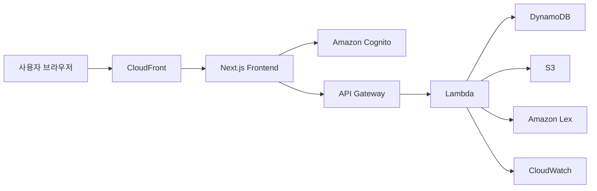

# AWS 아키텍처

## 1. 목표
이 데모의 AWS 아키텍처는 실제 금융 서비스 운영 수준 전체를 구현하기 위한 것이 아니라, 발표와 평가에서 **시스템 이해도와 확장 가능한 설계 구조**를 보여주기 위한 것이다.

## 2. 리소스 구성

| 영역 | AWS 리소스 | 역할 |
| --- | --- | --- |
| 프론트엔드 배포 | AWS Amplify Hosting 또는 ECS + ALB | Next.js 웹앱 배포 |
| DNS/CDN | Route 53, CloudFront | 도메인 연결, 정적 자산 캐싱 |
| 인증 | Amazon Cognito | 사용자 로그인 및 세션 관리 |
| API 계층 | Amazon API Gateway | 프론트엔드 요청 진입점 |
| 비즈니스 로직 | AWS Lambda | 계좌 요약, 상품 조회, AI 상담 프록시, 이체 검증 처리 |
| 데이터 저장 | Amazon DynamoDB | 사용자 요약 정보, 거래 더미 데이터 저장 |
| 파일 저장 | Amazon S3 | 정적 파일, 리포트, 이미지 저장 |
| AI | Amazon Lex | 금융 상담 의도 분류 및 대화 흐름 처리 |
| 모니터링 | Amazon CloudWatch | 로그 수집, 오류 추적 |

## 3. 연결 구조

## 4. 동작 흐름

### 로그인
1. 사용자가 로그인 페이지 접속
2. 실제 서비스에서는 Cognito User Pool로 인증 수행
3. 인증 성공 후 토큰 발급 및 보호 페이지 접근 권한 획득

### 대시보드 조회
1. 프론트엔드가 API Gateway로 사용자 요약 요청
2. Lambda가 DynamoDB에서 더미 계좌/거래 데이터 조회
3. 가공한 결과를 프론트엔드에 반환

### AI 챗봇 요청
1. 사용자가 챗봇 페이지에서 질문 입력
2. 프론트엔드가 API Gateway로 질문 전송
3. Lambda가 상담 컨텍스트를 구성해 Amazon Lex 호출
4. Lex 응답을 정리해 프론트엔드에 반환
5. CloudWatch에 요청 로그와 오류 기록

### 이체 시뮬레이션
1. 사용자가 이체 정보 입력
2. 프론트엔드가 API Gateway로 검증 요청 전송 가능
3. Lambda가 잔액, 금액 조건, 수취 정보 검증 수행
4. 결과를 프론트엔드에 반환하고 거래 로그를 기록하는 구조로 확장 가능

## 5. 발표 시 강조 포인트
- 프론트엔드, 인증, API, 데이터, AI가 서로 분리된 구조임
- 로그인 이후 보호 페이지 구조를 Cognito와 자연스럽게 연결해 설명할 수 있음
- AI 기능이 독립된 서비스가 아니라 기존 금융 서비스 흐름과 연결됨
- 이체 시뮬레이션도 Lambda 검증 구조로 확장 가능함
- 1주 프로젝트 특성상 실제 운영 자동화 대신 구조적 이해와 시연 가능성에 집중함

## 6. 확장 방향
- DynamoDB 대신 Aurora Serverless 검토 가능
- WAF 추가로 보안 구조 강화 가능
- Lex Intent/Slot 설계를 통해 금융 상담 흐름의 일관성 강화 가능
- CloudWatch Alarm과 SNS로 운영 알림 확장 가능
- 실제 거래 API 및 계좌계 시스템과 연계하는 방향으로 확장 가능
